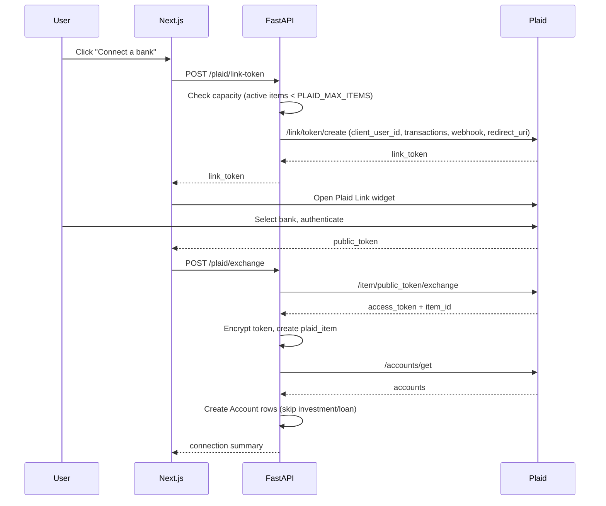
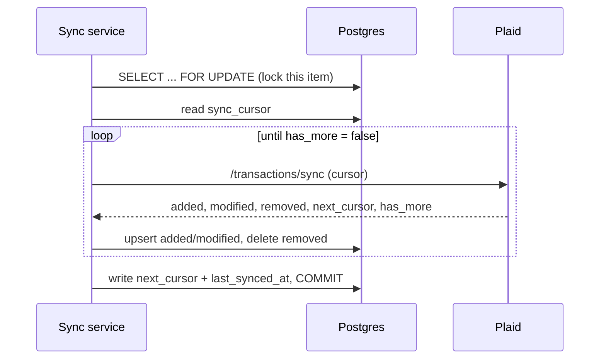

# Live Bank Connections — Architecture

How Statement Analyzer moves from "upload a PDF each month" to "transactions
arrive on their own," using Plaid, without throwing away the upload pipeline.

Status: design agreed, implementation in progress (see [Delivery plan](#delivery-plan)).

---

## 1. Goals and non-goals

**Goals**

- A user connects a real bank login once; transactions then land continuously.
- Budgets update against live spending instead of only after a manual upload.
- Statement upload keeps working unchanged, for banks we can't link and for
  users beyond the trial's connection cap.

**Non-goals (deliberately out of scope)**

- Payments, transfers, or anything that moves money. Read-only access only.
- Investment holdings, liabilities, identity, or balance-driven features.
- Replacing the Gemini statement parser. Linked accounts bypass it entirely;
  uploads still use it.
- Multi-currency. Everything assumes USD, as today.

**Constraint that shapes everything below:** Plaid's free Trial plan caps live
connections at ~10 *Items* **app-wide**, not per user. One person linking Chase
checking and an Amex card consumes two. The system must therefore treat live
connection as a scarce resource and degrade to uploads when exhausted.

---

## 2. Current system

```
PDF/CSV ──▶ pdfplumber/pandas ──▶ Gemini (structured prompt) ──▶ preview
                                                                   │
                                                          user confirms
                                                                   ▼
                                                            transactions
                                                                   │
                                              ┌────────────────────┴────────┐
                                              ▼                             ▼
                                        dashboard                       budgets
```

Auth: the Next.js frontend mints a short-lived HS256 token after Google
sign-in; FastAPI verifies it per request and resolves the user from the signed
`email` claim. No client-supplied identity is trusted. Live sync inherits this
model unchanged — with one exception, the webhook, covered in §7.

---

## 3. Target architecture

```
        ┌───────────────── Vercel · Next.js ─────────────────┐
        │  Accounts page → Plaid Link (hosted widget)        │
        │  /plaid/oauth  → redirect landing for OAuth banks  │
        └───────┬──────────────────────────────┬─────────────┘
         public_token                   Bearer session token
                │                              │
                ▼                              ▼
        ┌──────────────────── Fly.io · FastAPI ────────────────────┐
        │ routers/plaid.py                                          │
        │   POST /plaid/link-token        create + update mode      │
        │   POST /plaid/exchange          public → access token     │
        │   GET  /plaid/items             connection list + status  │
        │   POST /plaid/items/{id}/sync   manual refresh            │
        │   DELETE /plaid/items/{id}      disconnect                │
        │   POST /plaid/webhook           ← Plaid (signature-verified)│
        │                                                            │
        │ services/plaid_client.py   SDK wrapper, env-configured      │
        │ services/token_crypto.py   Fernet encrypt/decrypt           │
        │ services/plaid_sync.py     cursor loop, mapping, upsert     │
        │                                                            │
        │ routers/upload.py          UNCHANGED (Gemini path)          │
        └───────────────────────────┬────────────────────────────────┘
                                    ▼
                        Neon Postgres (shared tables)
```

Both ingestion paths converge on the same `transactions` table, so the
dashboard and budget aggregates need no knowledge of where a row came from.
That convergence is the central design decision: **live sync is a second
writer into an existing schema, not a parallel system.**

---

## 4. Data model

### `plaid_items` (new)

One row per connected bank login.

| Column | Purpose |
|---|---|
| `item_id` | Plaid's identifier. Unique; the idempotency key for the connection. |
| `access_token_encrypted` | Fernet-encrypted. Nullable — cleared on disconnect while the row survives. |
| `institution_id`, `institution_name` | Display, and for reconnect prompts. |
| `sync_cursor` | Position in Plaid's update stream. |
| `status` | `active` · `login_required` · `disconnected` |
| `error_code` | Last Plaid error, for surfacing "reconnect needed". |
| `last_synced_at` | Drives the "synced 4 minutes ago" label. |

### Extensions to existing tables

`accounts` gains `plaid_item_id` and `plaid_account_id`. Manual accounts leave
both `NULL` and behave exactly as before. One Item fans out to several accounts.

`transactions` gains:

| Column | Purpose |
|---|---|
| `source` | `upload` or `plaid`. Drives UI badges and upload-conflict rules. |
| `plaid_transaction_id` | **Unique.** The dedupe guarantee. |
| `pending` | Plaid reports a charge as pending, then re-reports it posted. |
| `category_overridden` | Set when a user recategorizes by hand. |

Why `UNIQUE` on a nullable column: Postgres permits unlimited `NULL`s under a
unique constraint, so every uploaded row coexists freely while synced rows
cannot be inserted twice — enforced by the database, not by application logic
that a retry could bypass.

---

## 5. Data flows

### 5.1 Connecting a bank



The capacity check happens **before** calling Plaid, so an over-cap user never
reaches a bank login screen they can't complete.

OAuth banks (Chase, Bank of America) redirect out to the bank's own site and
back to `/plaid/oauth`. That page re-initializes Link with the received
redirect URI; the `link_token` is held in `sessionStorage` to survive the round
trip. Without this page, every major bank fails.

### 5.2 Syncing transactions

Both the webhook and the manual button call one service. The loop:



Three invariants make this safe to run concurrently and to interrupt:

1. **The cursor advances only after the rows commit.** A crash mid-sync replays
   the same window rather than skipping it. Replay is harmless because of the
   unique constraint.
2. **The item row is locked for the duration.** A webhook firing while the user
   clicks "Sync now" serializes instead of double-importing.
3. **If Plaid reports the stream mutated mid-pagination**
   (`TRANSACTIONS_SYNC_MUTATION_DURING_PAGINATION`), the loop restarts from the
   last *stored* cursor. Partial pages are never committed as if complete.

Initial sync is the same path with a `NULL` cursor. Plaid assembles history
asynchronously, so the first call may return little; the
`SYNC_UPDATES_AVAILABLE` webhook signals when the backfill is ready.

### 5.3 Field mapping

| Plaid | App | Notes |
|---|---|---|
| `amount > 0` | `transaction_type = debit` | Plaid's sign convention is inverted: positive means money **out**. |
| `amount < 0` | `transaction_type = credit` | Stored as `abs()`, matching the upload path. |
| `personal_finance_category.primary` | `category` | Deterministic lookup — no LLM call, so live sync costs nothing per transaction. |
| `pending` | `pending` | Counted toward budgets; badged in the UI. |
| `name` / `merchant_name` | `description` | Prefer `merchant_name` when present. |

Category mapping: `FOOD_AND_DRINK`→Food & Dining, `GENERAL_MERCHANDISE`→Shopping,
`TRANSPORTATION`→Transport, `ENTERTAINMENT`→Entertainment, `MEDICAL`→Health,
`TRAVEL`→Travel, `INCOME`→Income, `RENT_AND_UTILITIES`→Rent or Utilities by
detailed subtype, `TRANSFER_IN`/`TRANSFER_OUT`/`LOAN_PAYMENTS`→**Transfers**,
everything else→Other.

Plaid has no "Subscriptions" equivalent; those land in Other until a user
recategorizes. Accepted gap, not worth an LLM call to close.

### 5.4 The double-counting problem

Once both checking and a credit card are linked, a $1,000 card payment appears
twice: leaving checking, and as the charges it settles. Summing every debit
would overstate spending by the payment amount, every month.

Resolution: transfers and loan payments map to a **`Transfers`** category that
is excluded from spend totals, category breakdowns, and budget progress. It
remains visible on the transactions page — the money did move, it just isn't
spending. The upload path's existing keyword filters for card payments stay as
a second line of defense.

### 5.5 Reconnect and disconnect

Bank logins expire. Plaid reports `ITEM_LOGIN_REQUIRED`, the item flips to
`login_required`, sync stops, and the UI surfaces "Reconnect". That flow issues
an update-mode `link_token` carrying the existing `access_token`, so the user
re-authenticates without re-selecting their bank or creating a second Item.

Disconnect revokes at Plaid (`/item/remove`), clears the stored token, and sets
`status = disconnected` — but **keeps accounts and transaction history**.
Losing months of categorized history because someone unlinked a bank would be
the worse failure. The account reverts to upload-only.

---

## 6. API contracts

All routes require the existing Bearer session token and resolve the user from
its verified claim. Every item-scoped route additionally verifies
`item.user_id == current_user.id` — ownership is never inferred from the URL.

| Method | Path | Request | Response |
|---|---|---|---|
| POST | `/plaid/link-token` | — | `{link_token, expiration}` |
| POST | `/plaid/link-token` | `{item_id}` | update-mode token for reconnect |
| POST | `/plaid/exchange` | `{public_token}` | `{item, accounts[]}` |
| GET | `/plaid/items` | — | `[{id, institution_name, status, last_synced_at, accounts[]}]` |
| POST | `/plaid/items/{id}/sync` | — | `{added, modified, removed}` counts |
| DELETE | `/plaid/items/{id}` | — | `204` |
| GET | `/plaid/capacity` | — | `{can_connect, active_items, limit}` |
| POST | `/plaid/webhook` | Plaid payload | `200` always |

`/plaid/capacity` exists so the frontend can hide the connect button and show
the upload path instead, rather than offering an action that will fail.

The webhook returns `200` even for events it ignores; non-2xx responses cause
Plaid to retry, and retrying an unknown event type accomplishes nothing.

---

## 7. Security model

The webhook is the one endpoint that cannot use session auth — Plaid has no
session. It is therefore the system's sole unauthenticated entry point, and is
protected by signature verification instead:

1. Read the `Plaid-Verification` JWT header; require `alg = ES256`.
2. Fetch the public key for the JWT's `kid` via `/webhook_verification_key/get`.
3. Verify the signature against that key.
4. Require `iat` within 5 minutes (replay window).
5. Recompute SHA-256 of the raw body and compare, in constant time, against
   `request_body_sha256` in the payload.

Only then does anything touch the database. Verification must run against the
**raw** body — re-serializing parsed JSON changes bytes and breaks the hash.

Other boundaries:

- **Access tokens** are Fernet-encrypted under `PLAID_TOKEN_ENCRYPTION_KEY`,
  held in Fly secrets, never in the database. A Neon dump alone yields nothing
  usable. Tokens never reach the frontend and are never logged.
- **`client_user_id`** sent to Plaid is the internal integer user id, never the
  email — Plaid's own docs ask for a non-PII identifier.
- **Blast radius of the trial cap:** the site is public and anyone with a Google
  account can sign in. Under the agreed first-come-first-served policy, ten
  strangers could consume every slot. Accepted for now because the cap is
  enforced server-side and the fallback is graceful, but an allowlist is the
  obvious lever if it's abused.

---

## 8. Runtime and failure modes

The Fly machine has `min_machines_running = 0` and stops when idle. This rules
out an in-process scheduler — a cron thread cannot run on a stopped machine.
Webhooks work *with* this: an inbound request wakes the machine, and Plaid
retries on failure, so a cold start costs latency rather than data.

| Failure | Detection | Response |
|---|---|---|
| Bank login expired | `ITEM_LOGIN_REQUIRED` | Mark `login_required`, surface Reconnect |
| User revoked access at bank | `USER_PERMISSION_REVOKED` | Mark `disconnected`, keep history |
| Plaid API down / 5xx | Exception in sync | Leave cursor untouched; next sync replays |
| Interrupted mid-pagination | Exception | Cursor unchanged → safe replay |
| Duplicate webhook delivery | — | Unique constraint absorbs it |
| Trial cap reached | Capacity check | Hide connect, fall back to upload |
| Webhook signature invalid | Verification step | `400`, no DB write, log the attempt |

---

## 9. Delivery plan

Each step is independently mergeable and leaves the app working.

| PR | Scope | Acceptance |
|---|---|---|
| 1 ✅ | Schema, models, config, deps | Migration renders valid DDL; models map; no behavior change |
| 2 | Plaid client, token crypto, routes, sync service | Sandbox link → transactions land, deduped on re-sync |
| 3 | Link UI, OAuth page, connections list | Full connect flow in browser; reconnect and disconnect work |
| 4 | Transfers exclusion, badges, upload conflict rules, doc refresh | Dashboard and budgets ignore Transfers; linked accounts reject uploads |

Testing uses Plaid's sandbox (`user_good` / `pass_good`), which returns
synthetic history with no real bank involved. Webhooks cannot reach localhost;
local work uses the manual sync button, and webhook verification is exercised
against the deployed Fly backend.

---

## 10. Open questions

- **Does removing an Item free a trial slot?** The cap's accounting isn't
  documented clearly enough to rely on. Worth confirming with Plaid before the
  connect button starts refusing users.
- **Upload into a linked account** is blocked to prevent overlapping data. If
  someone wants history older than Plaid's window (~24 months), they currently
  need a separate manual account. Acceptable, revisit if it bites.
- **`budgets/status` doesn't filter on `confirmed`** while the dashboard does —
  a pre-existing inconsistency that live pending transactions will make
  visible. Fixed in PR 4.
